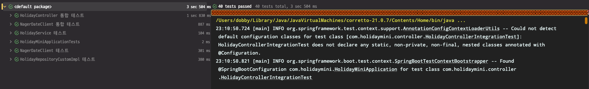

# holiday-mini

## 빌드 & 실행 방법
```bash
# 1) 클린 빌드
./gradlew clean build

# 2) 생성된 JAR 실행
java -jar build/libs/holiday-mini-1.0.0.jar
```

## Holidays API 명세 요약

### 1. 공휴일 목록 조회

`POST /api/holidays`

| 구분       | 내용                                                                                                                                                                                        |
|----------|-------------------------------------------------------------------------------------------------------------------------------------------------------------------------------------------|
| URL      | `/api/holidays`                                                                                                                                                                           |
| Method   | `POST`                                                                                                                                                                                    |
| Query    | `page` (integer, 기본값 `0`) <br> `size` (integer, 기본값 `20`) <br> `sort` (string\[], 기본값 `["date","asc"]`)                                                                                   |
| Request  | **Body** (`application/json`) <br> `jsonc {  // HolidaySearchFilter   "countryCode": "KR",   "year": 2021,   "startDate": "2021-01-01",   "endDate": "2021-12-31",   "type": "PUBLIC" } ` |
| Response | **200 OK**                                                                                                                                                                                |

---

### 2. 공휴일 재동기화 (Upsert)

`PATCH /api/holidays`

| 구분       | 내용                                                              |
| -------- | --------------------------------------------------------------- |
| URL      | `/api/holidays`                                                 |
| Method   | `PATCH`                                                         |
| Query    | `countryCode` (string, 필수) <br> `year` (integer, 2020–2025, 필수) |
| Request  | 없음                                                              |
| Response | **200 OK** <br> **Body**: 없음                                    |

---

### 3. 공휴일 삭제

`DELETE /api/holidays`

| 구분       | 내용                                                   |
| -------- | ---------------------------------------------------- |
| URL      | `/api/holidays`                                      |
| Method   | `DELETE`                                             |
| Query    | `countryCode` (string, 필수) <br> `year` (integer, 필수) |
| Request  | 없음                                                   |
| Response | **204 No Content** <br> **Body**: 없음                 |

각 엔드포인트는 인증 없이 호출 가능하며, 입력값 검증에 실패하거나 등록되지 않은 국가 코드일 경우 **400 Bad Request**를 반환

---
## Test 성공 스크린샷




## Swagger UI

[Swagger UI 바로가기 링크](https://dobby-kim.github.io/holiday-mini)

## 세부 기능 요구사항

### 1. 데이터 적재: 최초 실행 시 2020-2025년 모든 국가 공휴일 일괄 적재

- [ ] 외부 API에서 전체 국가 목록을 조회한다
- [ ] 조회된 모든 국가를 데이터베이스에 저장한다
- [ ] 각 국가별로 2020년부터 2025년까지의 공휴일 데이터를 조회한다
    - [ ] 국가별로 6개년도 데이터를 순차적으로 처리한다
    - [ ] 조회 실패한 국가는 로그에 기록하고 다음 국가로 진행한다
- [ ] 조회된 공휴일 데이터를 데이터베이스에 저장한다
    - [ ] 날짜, 공휴일명(현지/영문), 국가코드, 연도 등 필수 정보를 저장한다
    - [ ] 공휴일 타입 정보를 별도로 저장한다
- [ ] 전체 적재 완료 후 처리 결과를 반환한다
    - [ ] 성공한 국가 수와 실패한 국가 수를 표시한다

### 2. 검색: 연도별/국가별 필터 기반 공휴일 조회 (페이징)

- [ ] 다양한 조건으로 공휴일을 검색할 수 있다
    - [ ] 특정 연도로 필터링한다
    - [ ] 특정 국가코드로 필터링한다
    - [ ] 날짜 범위(from ~ to)로 필터링한다
    - [ ] 공휴일 타입으로 필터링한다
    - [ ] 모든 필터는 선택적으로 적용 가능하다
- [ ] 검색 결과를 페이징 처리한다
    - [ ] 페이지 크기를 지정할 수 있다 (기본값: 20)
    - [ ] 페이지 번호를 지정할 수 있다
    - [ ] 정렬 기준을 지정할 수 있다 (기본값: 날짜순)
- [ ] 검색 결과와 함께 페이지 정보를 반환한다
    - [ ] 전체 데이터 수, 전체 페이지 수, 현재 페이지 등을 포함한다

### 3. 재동기화: 특정 연도/국가 데이터 Upsert

- [ ] 특정 연도와 국가코드를 입력받아 해당 데이터를 재동기화한다
    - [ ] 입력된 연도는 2020-2025 범위 내여야 한다
    - [ ] 입력된 국가코드는 2자리 ISO 코드여야 한다
- [ ] 외부 API에서 최신 공휴일 데이터를 조회한다
- [ ] 기존 데이터를 삭제하고 새 데이터로 교체한다
    - [ ] 삭제와 저장은 하나의 트랜잭션으로 처리한다
    - [ ] 실패 시 기존 데이터를 유지한다
- [ ] 동기화 결과를 반환한다
    - [ ] 동기화된 공휴일 개수를 표시한다

### 4. 삭제: 특정 연도/국가 공휴일 전체 삭제

- [ ] 특정 연도와 국가코드를 입력받아 해당 공휴일을 삭제한다
    - [ ] 입력된 연도는 2020-2025 범위 내여야 한다
    - [ ] 입력된 국가코드는 2자리 ISO 코드여야 한다
- [ ] 해당 조건의 모든 공휴일 데이터를 삭제한다
- [ ] 삭제 결과를 반환한다
    - [ ] 삭제된 레코드 수를 표시한다
    - [ ] 삭제할 데이터가 없는 경우 0을 반환한다

### 5. 배치 자동화: 매년 1월 2일 01:00 KST 전년도/금년도 데이터 자동 동기화 (선택)

- [ ] 매년 1월 2일 01:00 KST에 자동으로 실행된다
- [ ] 등록된 모든 국가에 대해 동기화를 수행한다
    - [ ] 전년도 데이터를 동기화한다
    - [ ] 금년도 데이터를 동기화한다
- [ ] 개별 국가 동기화 실패 시에도 다른 국가는 계속 처리한다
- [ ] 배치 실행 결과를 로그에 기록한다
    - [ ] 시작 시간과 종료 시간을 기록한다
    - [ ] 성공/실패한 국가 수를 기록한다
- [ ] 설정으로 배치 실행을 활성화/비활성화할 수 있다
